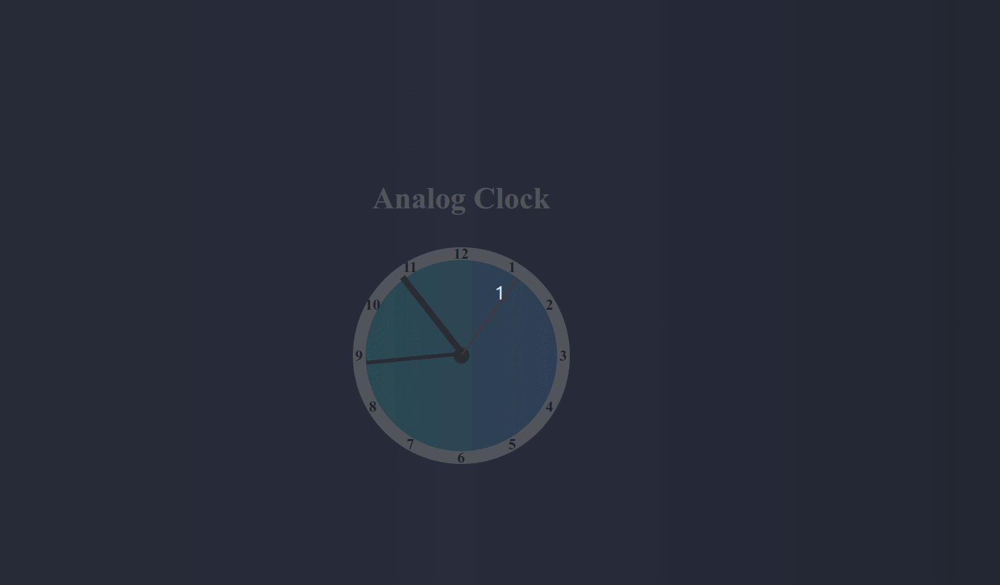

# Analog Clock DOM Widget

## Description

This project presents an elegant analog clock designed using HTML, CSS, and JavaScript. Users can view the real-time ticking of the clock, driven by JavaScript logic and enhanced by CSS styling.

## Features

- **Real-time Ticking:** The clock hands (hour, minute, second) move in real-time, offering a true representation of the current time.

- **Elegant Design:** The clock incorporates a sleek design, with distinct hour, minute, and second hands, as well as clock numbers from 1 to 12.

## JavaScript Techniques

- **DOM Manipulation:** The script leverages the document.querySelector() method to fetch references to various HTML elements, such as the clock hands.

- **Date and Time Handling:** The built-in Date object is employed to retrieve the current time, which is then used to calculate the appropriate rotation for each clock hand.

- **Dynamic Styling:** The CSS transform property is dynamically updated to rotate the clock hands, giving the illusion of ticking.

- **Real-time Update:** The setInterval function ensures that the setDate function is triggered every second, enabling the clock hands to move in real-time.
